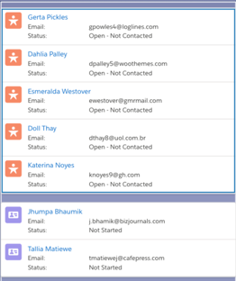

## Easy Spaces

Easy Spaces is a fictional event management company that creates and manages custom pop-up spaces for companies and individuals. Easy Spaces helps customers create temporary spaces like cafés, game rooms or themed rooms for special occasions in their offices and homes.

[](https://youtu.be/ZwvegTLx9kk)

## Table of Contents

*   [Features](#features)
*   Installation
    *   [By URL](#install-by-url)
    *   [Using Salesforce DX](#install-using-salesforce-dx)
*   [Code Highlights](#code-highlights)
*   [Additional Resources](#additional-resources)

## Features

A quick overview of the features you can explore with Easy Spaces:

*  Modular app design and Unlocked Packaging
*  Lightning Console & Workspace API
*	Lightning Flow 
	* 	Dynamic flow interview components
	*  Custom flow screen components
	*  Local Action components
* 	Custom Lightning Page Templates
*	Lightning Themes and Design Token Bundles
* 	Custom Metadata Types

## Installation

### Install by URL
Use this option if you don't have Salesforce DX configured and want to experience the sample app.

1. [Sign up](https://developer.salesforce.com/signup) for a Developer Edition (DE) org.

1. Enable MyDomain in your DE org. Instructions to do this are [here](https://trailhead.salesforce.com/projects/quickstart-lightning-components/steps/quickstart-lightning-components1).

1. Click [this link](https://login.salesforce.com/packaging/installPackage.apexp?p0=04tB00000006FFSIA2) to install the **ESBaseObjects** package and choose **Install for All Users**.

1. Click [this link](https://login.salesforce.com/packaging/installPackage.apexp?p0=04tB00000006FFXIA2) to install the **ESBaseCode** package and choose **Install for All Users**.

1. Click [this link](https://login.salesforce.com/packaging/installPackage.apexp?p0=04tB00000006FFcIAM) to install the **ESBaseStyles** package and choose **Install for All Users**.

1. Click [this link](https://login.salesforce.com/packaging/installPackage.apexp?p0=04tB00000006FFhIAM) to install the **SpaceManagementApp** package and choose **Install for All Users**.

1.  From the command line, clone this repository:

    ```zsh
    git clone https://github.com/trailheadapps/easy-spaces
    cd easy-spaces
    ```

1. Import Lead data:
    - In **Setup**, type **Data Import** in the Quick Find box and click **Data Import Wizard**.
    - Click **Launch Wizard**.
    - Click the **Standard objects** tab, click **Leads**, and click **Add New Records**.
    - Drag **Lead_Data.csv** from the data folder of this project to the upload area.
    - Click **Next**, **Next**, and **Start Import**.

1. Import Contact data:
    - In **Setup**, type **Data Import** in the Quick Find box and click **Data Import Wizard**.
    - Click **Launch Wizard**.
    - Click the **Standard objects** tab, click **Accounts and Contacts**, and click **Add New Records**.
    - Drag **Contact_Data.csv** from the data folder of this project to the upload area.
    - Click **Next**, **Next**, and **Start Import**.

1. Import Market data:
    - In **Setup**, type **Data Import** in the Quick Find box and click **Data Import Wizard**.
    - Click **Launch Wizard**.
    - Click the **Custom objects** tab, click **Market**, and click **Add New Records**.
    - Drag **Market_Data.csv** from the data folder of this project to the upload area.
    - Click **Next**, **Next**, and **Start Import**.

1. Import Spaces data:
    - Open the **Space_Data.csv** from the data folder of this project.
    - In the **Market__c** column, add the record Id for the correct Market imported in the previous step. Use the **Market City Name** column to help match spaces to the correct Market.
    - Save the changes to your file. *Note: You __must__ choose UTF-8 encoding when you save the file.*
    - In **Setup**, type **Data Import** in the Quick Find box and click **Data Import Wizard**.
    - Click **Launch Wizard**.
    - Click the **Custom objects** tab, click **Space**, and click **Add New Records**.
    - Drag **Space_Data.csv** from the data folder of this project to the upload area.
    - Click **Next**, **Next**, and **Start Import**.
    - If you see any issues with restricted picklist values blocking import, double-check that you saved your .csv with UTF-8 encoding and try again.


1. Follow the instructions in the **Completing the Installation** section below to enable the Easy Spaces custom theme.

1. In **App Launcher**, select the **Space Management** app.

1. Note: Before trying to work with the Spaces Designer, use the **Reservation Manager** to create some draft reservations.

1. Have fun exploring!


### Install Using Salesforce DX

1.  Authenticate with your hub org (if not already done):

    ```zsh
    sfdx force:auth:web:login -d -a myhuborg
    ```

1.  Clone this repository:

    ```zsh
    git clone https://github.com/trailheadapps/easy-spaces
    cd easy-spaces
    ```

1.  Create a scratch org and provide it with an alias (**easyspaces** in the command below):

    ```zsh
    sfdx force:org:create -s -f config/project-scratch-def.json -a easyspaces
    ```

1.  Install the ESBaseObjects package in your scratch org:

    ```zsh
    sfdx force:package:install --package 04tB00000006FFSIA2
    ```

1.  Install the ESBaseCode package in your scratch org:

    ```zsh
    sfdx force:package:install --package 04tB00000006FFXIA2
    ```

1.  Install the ESBaseStyles package in your scratch org:

    ```zsh
    sfdx force:package:install --package 04tB00000006FFcIAM
    ```

1.  Install the SpaceManagementApp package in your scratch org:

    ```zsh
    sfdx force:package:install --package 04tB00000006FFhIAM
    ```

1.  Assign two EasySpaces permission sets to the default user:

    ```zsh
    sfdx force:user:permset:assign -n EasySpacesObjects
    sfdx force:user:permset:assign -n SpaceManagementApp
    ```

1.  Load sample data:

    ```
    sfdx force:data:tree:import --plan ./data/Plan1.json
    sfdx force:data:tree:import --plan ./data/Plan2.json
    ```

1.  Open the scratch org:
    ```
    sfdx force:org:open 
    ```

1. Follow the steps below to configure the app theme.

## Completing the Installation

### Configure the Easy Spaces theme
1. In **Setup**, navigate to **Themes and Branding**
1. Select **New Theme**
1. Use the following values to configure your theme:
	- Theme Name: Easy Spaces
	- Brand Color: #B2FDDA
	- Brand Image: Upload the 'easy_spaces_tile_small.png' file from the 'es-images' folder in your cloned repo
	- Page Background & Global Header Background: #8E94C0
	- *Optional* Upload the remaining images in the 'es-images' folder as the Default Group & Default User Profile Banner Images
1. Save & activate your theme 

## Code Highlights

### Dynamic Flows and Local Action Components

The **spaceDesigner** and **reservationHelper** components render flow interviews dynamically, by using the **lightning:flow** base component. You can see the **customerDetails** and **smartGallery** components at work as screens in these dynamic flows. Both of these components use the functionality of the **lightning:availableForFlowScreens** interface to control flow navigation actions.

See this [blog post](https://developer.salesforce.com/blogs/2018/06/announcing-the-easy-spaces-app.html) for more detail about custom flow navigation and dynamic flow interviews.

Components used as Lightning Flow screens also enforce a convention in the markup of their design files, to help developers better track how attributes are being used by flow interviews. See the [customerDetails](./es-space-mgmt/main/default/aura/customerDetails/customerDetails.design) and [smartGallery](./es-space-mgmt/main/default/aura/smartGallery/smartGallery.design) component design files for examples.

### Object-Agnostic Design

The **customerList** and **customerTile** components can display information from Contact objects or Lead objects. 



The customerList component uses a design attribute to allow for users working in Lightning App Builder to control which object an instance of the component should display:


This is just one example of object-agnostic design at work in Easy Spaces. See this [blog post](https://developer.salesforce.com/blogs/2018/06/announcing-the-easy-spaces-app.html) for more detail about this pattern.

### Workspace API

Easy Spaces uses the Workspace API to provide customized navigation behavior and control the tabs and subtabs in the Space Management console app. You can see the Workspace API at work in the **openRecordAction**, **reservationHelper** and **spaceDesigner** components. You can get more detail about using this API in your components in this [blog post](https://developer.salesforce.com/blogs/2018/06/announcing-the-easy-spaces-app.html). 

### Modular Design and Unlocked Packaging

Easy Spaces illustrates how to organize application metadata into granular units or modules. This approach is reflected in the design patterns at work throughout the application, like the use of design tokens and object-agnostic components. But you'll also see this at work in the structure of the Easy Spaces repo itself. 

To install the Easy Spaces application, you'll need to install several, interdependent unlocked packages. The dependecies between the Easy Spaces packages are listed in the [sfdx-project.json](./sfdx-project.json) file for this repo. 

You can also explore the contents of each package by looking at the related package folder within this repo. The `path` attribute entries in the sfdx-project.json show which folder contains the metadata for a particular package. 

For more about how the Easy Spaces metadata is organized into package modules, check out [this post](https://developer.salesforce.com/blogs/2018/06/working-with-modular-development-and-unlocked-packages-part-2.html).
